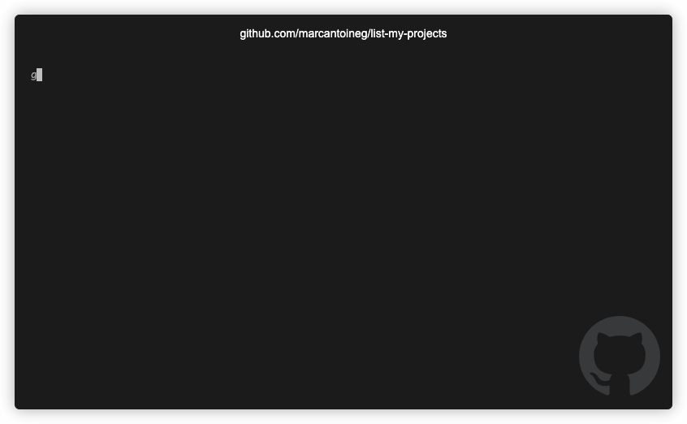

# 📚 ls-projects

A simple Go app to list projects and open them in a new window of VS Code.

This app uses [Bubble Tea](https://github.com/charmbracelet/bubbletea/) as its UI framework.

<em>without a meme, is it really a nice repo?</em>

## Configuration

The CLI will read the file at `~/.config/list-my-project/.project.json`, don't forget to copy your config file if you edited the one provided in this project.

## Usage
You can either use it with `go run main.go` or by exporting it as a binary in your PATH using `go build -o <binary_path/binary_name>`.
